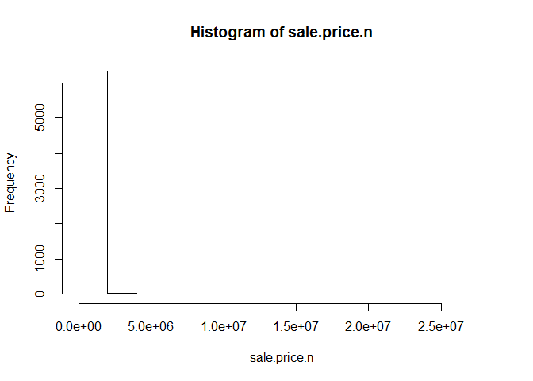

# Housing Sales Analysis for Staten Island borough
Johnny Quick, Olufemi Adesanya, and Celia Taylor  
June 1, 2016  

## Analysis of gross square feet to sales price

The following code calls the Main.R script which sets environment variables,
ensures packages are loaded that are needed, and then calls 3 R scripts:
LoadData.R, CleanData.R, and AnalyzeData.R

LoadData.R reads an Excel file for Staten Island Sales

CleanData.R does the following:
  Cleans up sales price and makes it numeric
  Makes all variable names lower case
  Gets rid of leading digits for gross square feet and land
  Changes sales date to R's date format
  Subsets year from the sales date into a variable
  Removes homes with sales prices of 0
  Removes homes with sales prices that don't seem like actual sales
  
AnalyzeData.R does a plot of gross square feet related to sales price

```r
maind <- "/Users/Johnny/OneDrive/Documents/6306/Unit3/StatenIslandRepo"
setwd(maind)
source("Main.R")
```

```
## Loading required package: gtools
```

```
## Loading required package: gdata
```

```
## gdata: read.xls support for 'XLS' (Excel 97-2004) files ENABLED.
```

```
## 
```

```
## gdata: read.xls support for 'XLSX' (Excel 2007+) files ENABLED.
```

```
## 
## Attaching package: 'gdata'
```

```
## The following object is masked from 'package:stats':
## 
##     nobs
```

```
## The following object is masked from 'package:utils':
## 
##     object.size
```

```
## The following object is masked from 'package:base':
## 
##     startsWith
```

```
## Loading required package: plyr
```

<!-- -->

As you can see from the plot above, there is a positive linear relation between gross square feet and sales price for housing in the Staten Island borough
